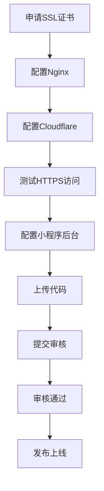

# 天虹紧固件小程序 - 正式发布文档

## 📚 文档导航

本文档集合提供了小程序正式发布的完整指南，包括Nginx配置、Cloudflare配置、测试脚本等。

### 核心文档

| 文档 | 说明 | 适用场景 |
|------|------|----------|
| **发布指南.md** | 完整发布流程，从服务器配置到小程序上线 | 首次发布或更新版本 |
| **nginx-ssl-config.md** | Nginx SSL证书详细配置 | 配置Nginx HTTPS |
| **cloudflare-config.md** | Cloudflare SSL/TLS和安全配置 | 配置Cloudflare代理 |
| **问题修复指南.md** | 常见问题排查和解决 | 遇到问题时参考 |

### 脚本工具

| 脚本 | 说明 | 使用方法 |
|------|------|----------|
| **setup-nginx-ssl.sh** | 一键配置Nginx SSL | `bash scripts/setup-nginx-ssl.sh` |
| **test_https_config.py** | HTTPS配置验证 | `python3 tests/test_https_config.py` |
| **test_server_api.py** | API接口测试 | `python3 tests/test_server_api.py` |

## 🚀 快速开始

### 1. 安装Nginx和SSL（可选，已申请证书）

如果你已经申请了Let's Encrypt证书，直接运行快速配置脚本：

```bash
cd /app
bash scripts/setup-nginx-ssl.sh
```

### 2. 验证HTTPS配置

运行验证脚本，检查所有配置是否正常：

```bash
cd /app/tests
python3 test_https_config.py
```

### 3. 配置Cloudflare

按照 `docs/cloudflare-config.md` 配置Cloudflare SSL/TLS模式为 Full。

### 4. 配置小程序后台

- 登录微信公众平台
- 配置服务器域名：`https://tnho-fasteners.com`
- 上传小程序代码
- 提交审核

## 📋 发布检查清单

### 服务器配置 ✅

- [ ] Let's Encrypt证书已申请
- [ ] Nginx已安装并启动
- [ ] Nginx SSL配置已完成
- [ ] 应用正在运行（端口8000）
- [ ] HTTPS访问正常（`https://tnho-fasteners.com/health`）

### Cloudflare配置 ✅

- [ ] DNS记录已配置并代理（橙色云朵）
- [ ] SSL/TLS模式设置为 Full
- [ ] Always Use HTTPS已启用
- [ ] 缓存规则已配置（可选）
- [ ] 安全规则已配置（可选）

### 小程序配置 ✅

- [ ] 小程序已注册并获取AppID
- [ ] 小程序基本信息已完善
- [ ] 服务器域名已配置：
  - [ ] request合法域名
  - [ ] uploadFile合法域名
  - [ ] downloadFile合法域名
- [ ] API地址已更新为 `https://tnho-fasteners.com`
- [ ] 小程序代码已上传
- [ ] 已提交审核
- [ ] 审核通过并发布

## 🔧 常用命令

### 服务器管理

```bash
# 查看Nginx状态
sudo systemctl status nginx

# 重启Nginx
sudo systemctl restart nginx

# 查看Nginx访问日志
sudo tail -f /var/log/nginx/tnho-fasteners-access.log

# 查看Nginx错误日志
sudo tail -f /var/log/nginx/tnho-fasteners-error.log

# 测试Nginx配置
sudo nginx -t

# 查看应用状态
ps aux | grep "python app.py"

# 重启应用
cd /app
python app.py
```

### 证书管理

```bash
# 查看证书续期任务
sudo systemctl status certbot.timer

# 手动测试证书续期
sudo certbot renew --dry-run

# 查看证书信息
sudo certbot certificates
```

### 测试命令

```bash
# 测试HTTPS访问
curl https://tnho-fasteners.com/health

# 测试API接口
cd /app/tests
python3 test_server_api.py

# 测试HTTPS配置
python3 test_https_config.py
```

## 📖 详细文档

### 1. 发布指南 (`docs/发布指南.md`)

完整的发布流程，包括：

- 服务器配置（Nginx、SSL）
- Cloudflare配置
- 小程序后台配置
- 代码上传和审核
- 发布上线
- 发布后维护

### 2. Nginx SSL配置 (`docs/nginx-ssl-config.md`)

Nginx详细配置说明，包括：

- Nginx安装和配置
- SSL证书配置
- HTTP到HTTPS重定向
- 反向代理配置
- 常见问题排查

### 3. Cloudflare配置 (`docs/cloudflare-config.md`)

Cloudflare配置说明，包括：

- SSL/TLS模式配置
- DNS记录配置
- 缓存规则配置
- 安全规则配置
- 性能优化建议

### 4. 问题修复指南 (`miniprogram/问题修复指南.md`)

常见问题排查和解决，包括：

- 图片上传失败
- 视频生成失败
- HTTPS证书问题
- 域名配置问题

## 🎯 发布流程总览



## ⚠️ 注意事项

### 1. SSL证书

- ✅ 使用Let's Encrypt正式证书（已申请）
- ❌ 不能使用自签名证书
- 证书已配置自动续期
- 有效期：2026-04-13

### 2. 小程序域名要求

- 必须使用HTTPS
- 必须在微信公众平台配置白名单
- 证书必须受信任（Let's Encrypt）

### 3. Cloudflare配置

- SSL/TLS模式必须设置为 Full
- DNS记录必须代理（橙色云朵）
- Always Use HTTPS必须启用

### 4. 开发环境 vs 生产环境

| 环境 | API地址 | SSL证书 | 域名校验 |
|------|---------|---------|----------|
| 开发 | http://47.110.72.148 | 不需要 | 关闭 |
| 生产 | https://tnho-fasteners.com | Let's Encrypt | 开启 |

## 📞 获取帮助

如果遇到问题：

1. 查看服务器日志
2. 运行测试脚本
3. 参考问题修复指南
4. 查阅官方文档

### 官方文档

- [微信小程序官方文档](https://developers.weixin.qq.com/miniprogram/dev/framework/)
- [Let's Encrypt官方文档](https://letsencrypt.org/docs/)
- [Nginx官方文档](https://nginx.org/en/docs/)
- [Cloudflare官方文档](https://developers.cloudflare.com/)

## 📅 版本历史

| 版本 | 日期 | 说明 |
|------|------|------|
| v1.0.0 | 2025-01 | 初始版本，支持AI视频生成 |

## ✅ 完成状态

- [x] Let's Encrypt证书已申请
- [x] Nginx配置文档已创建
- [x] Cloudflare配置文档已创建
- [x] 发布指南已创建
- [x] 快速配置脚本已创建
- [x] 测试脚本已创建
- [x] 小程序API地址已更新为HTTPS
- [ ] Nginx已安装和配置（待执行）
- [ ] Cloudflare已配置（待执行）
- [ ] 小程序后台域名已配置（待执行）
- [ ] 小程序代码已上传（待执行）
- [ ] 已提交审核（待执行）
- [ ] 已发布上线（待执行）

---

**最后更新时间**：2025年1月
**适用版本**：小程序 v1.0.0
**维护者**：天虹紧固件开发团队

祝你发布顺利！🎉
